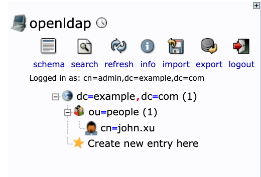
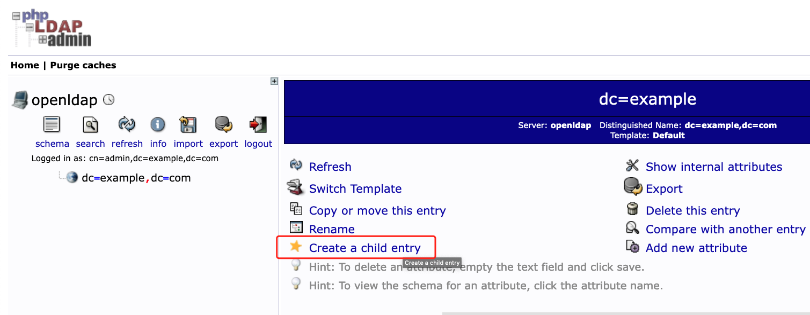
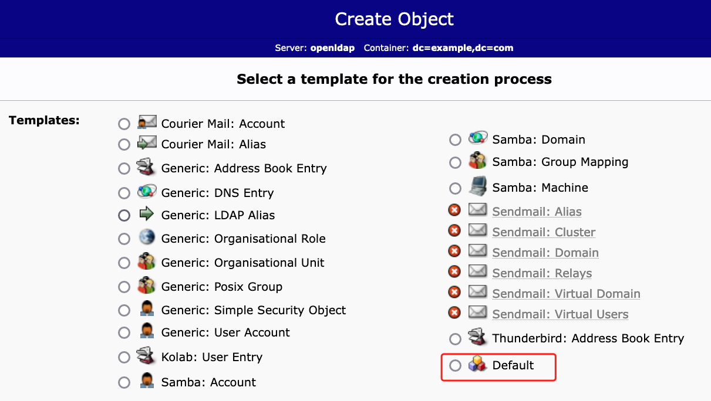
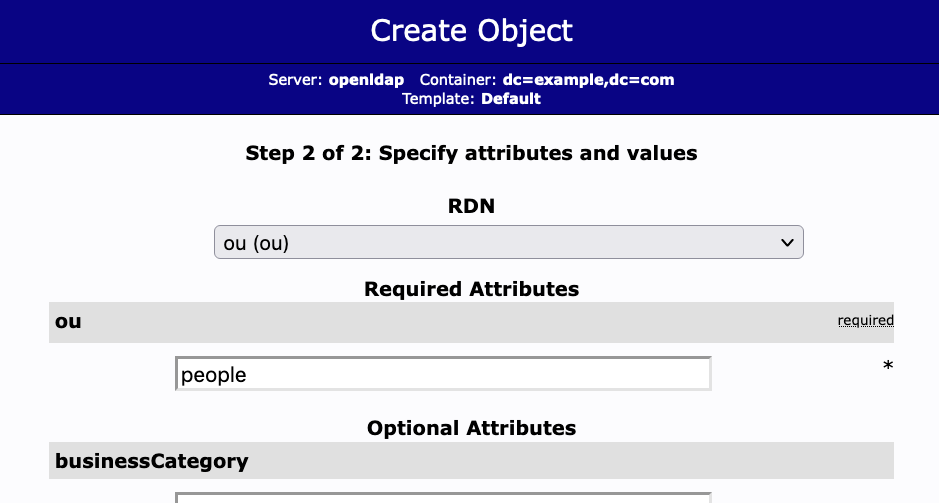
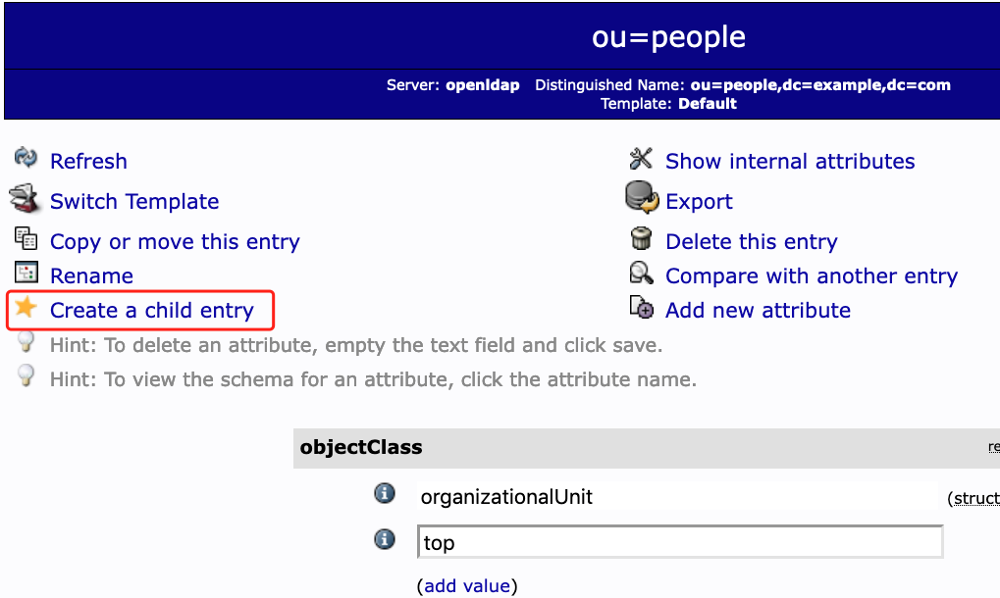
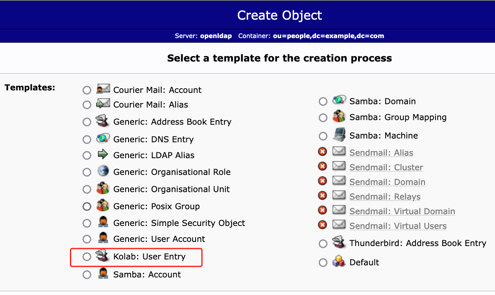
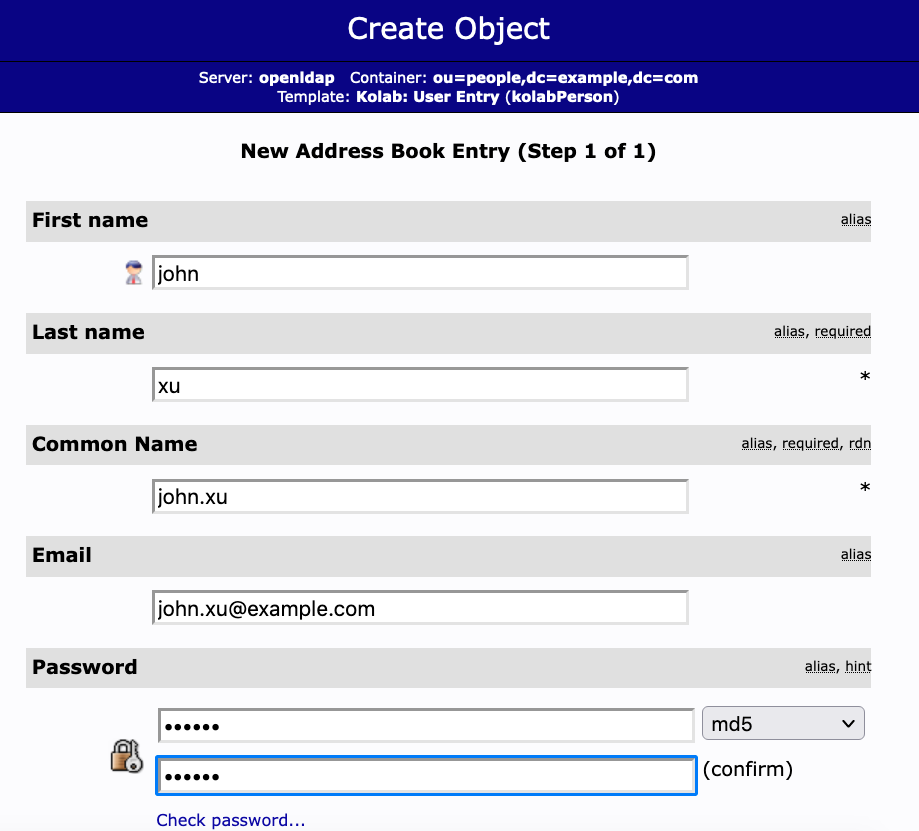
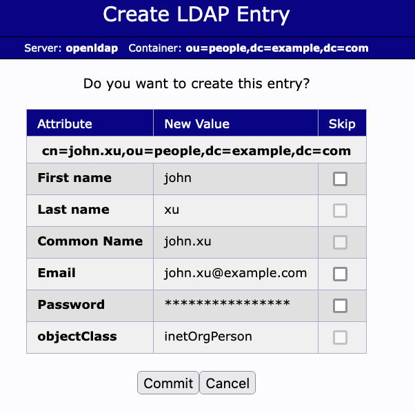

## Guide about how to create a org and add user




Firstly, you can try it on a local server.

```bash
$ docker-compose up
```


Visit http://localhost:30004

with user: cn=admin,dc=example,dc=com password: 123456


### create people org











### create person












